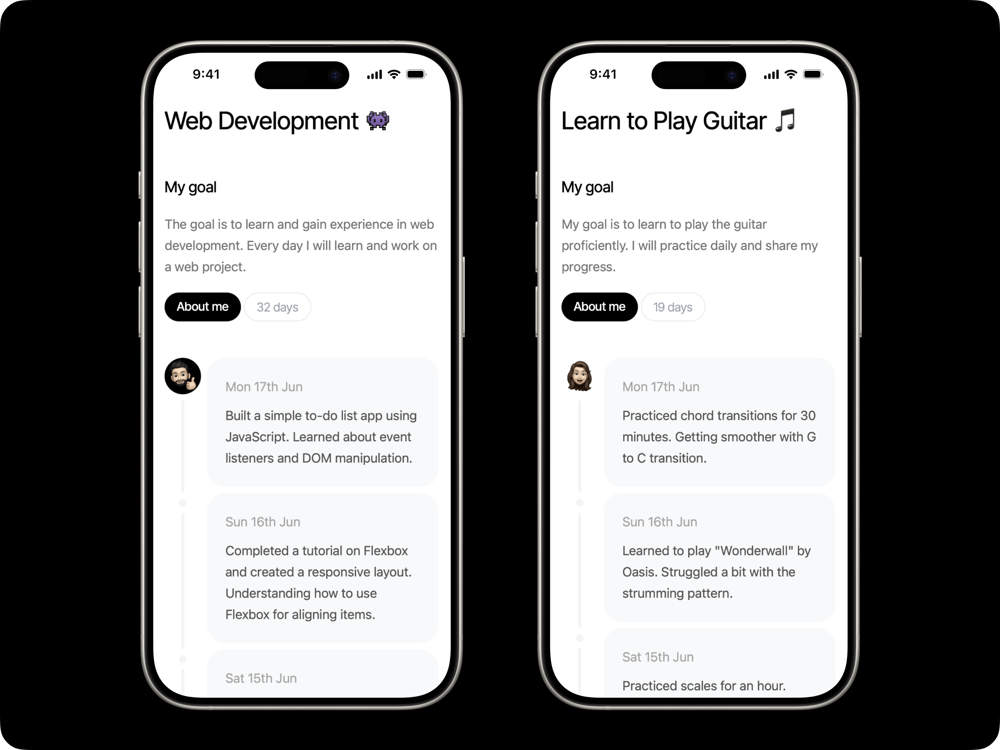

# Daily journal template made in SvelteKit

This is a simple daily journal example made in SvelteKit.
It is a simplified version of [Journaly](https://journaly.me).

- uses SvelteKit, TailwindCSS, TypeScript
- statically generated from Markdown files
- easy to deploy to Vercel, Netlify or other platforms
- animated with Motion One
- fully customisable to your needs

## Why?

The American Society of Training and Development found that people are 65 % more likely to meet a goal after making a commitment to someone else.
The chances increase by an amazing 95 % when you start to share regular progress on the goal.

That is why I created this project.
A simple journal website for you to share your goals, daily progress and ideas easily.

You can of course use it based on your needs. It is fully customisable and easy to deploy.

## Installation

Install all dependencies with your favorite package manager:

```bash
pnpm install
```

## Developing

Once you've installed dependencies, start a development server:

```bash
pnpm run dev
```

## Usage

### Add a new entry
Simply create a new markdown file in the `src/lib/stories` folder with the following format:

```
---
date: Wed 12th Jun
---

Story content goes here.
```

### Change a profile image
Replace the `profile-1.png` file in the `src/lib/assets` folder with your own image.

### Edit journal title, description, and more
Edit the `src/lib/assets/constants.ts` file to change all displayed information in one place.

## Deployment

To build the project, run:

```bash
pnpm run build
```

I recommend deploying to Vercel or similar platforms for the easiest setup.
